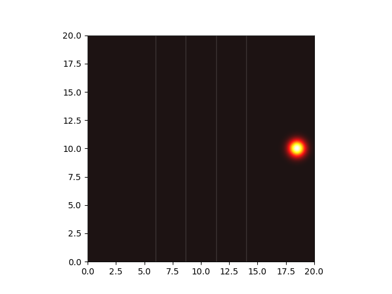
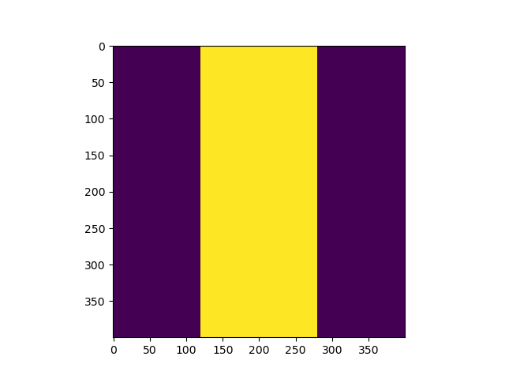
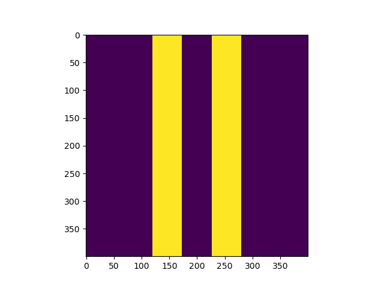
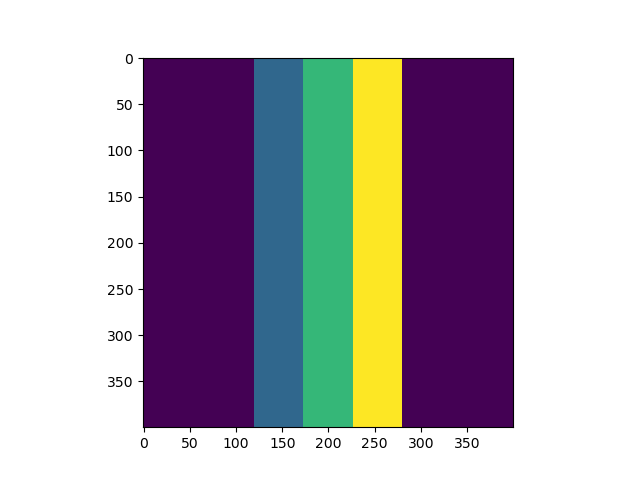

2D Crank-Nicolson simulations, notebooks, and analysis for the Schrodinger Equation with potentials (including some dynamic potentials)

Some samples from simulations

<table>
    <td>
        <td>|Ψ|\*|Ψ|</td>
        <td>V(x, t)</td>
    </tr>
    <tr>
        <td></td>
        <td></td>
    </tr>
    <tr>
        <td></td>
        <td></td>
    </tr>
    <tr>
        <td></td>
        <td></td>
    </tr>
</table>

